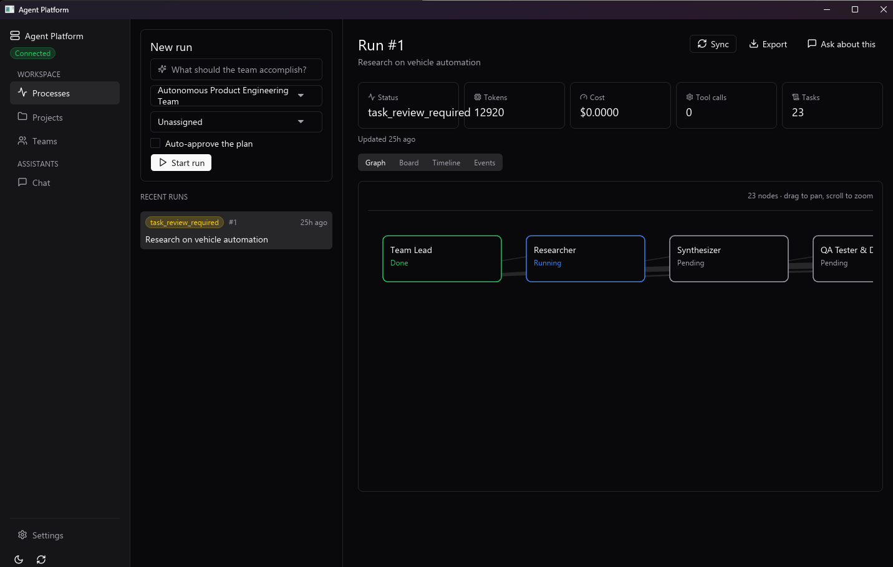
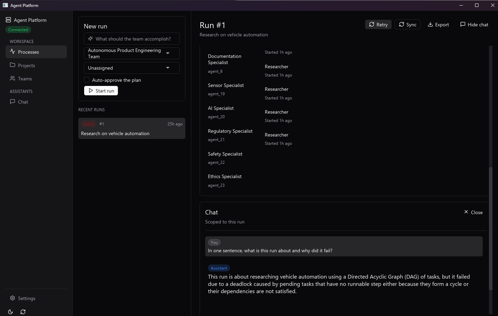
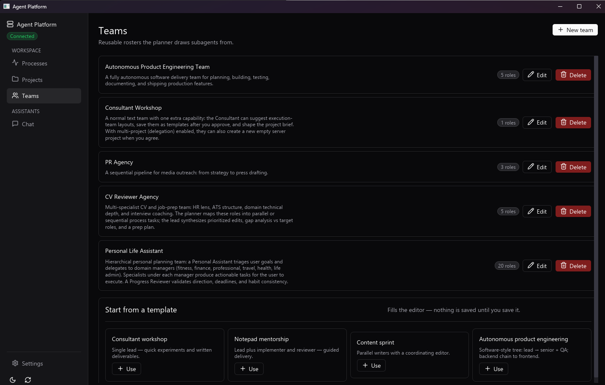

# Agent Platform

Lean **AI server**: multi-agent orchestration API with an **embedded** OpenAI-compatible LLM proxy (`/v1/*` on the same process).

**Portfolio context:** The backend is the product. The UI is a native desktop app ([`desktop/`](desktop/), Rust + iced) that talks to this API — the server ships no browser UI of its own beyond the `/tokens` dashboard.

- **API:** `http://127.0.0.1:18410` — OpenAPI at **`/docs`**, model build/train at **`/api/v1/model-ops/*`** ([`docs/model-ops-api.md`](docs/model-ops-api.md))
- **Tokens:** `http://127.0.0.1:18410/tokens` — issue and revoke workspace API tokens
- **Everything else** — runs, teams, projects, providers, model ops — lives in the desktop app

Provider catalog behavior is normalized across `/api/v1/llm-proxy/ui/providers` and `/api/v1/llm-proxy/test/model-options`: each provider exposes the same capability shape (`streaming`, `tools`, `json_mode`, `model_discovery`). When a provider cannot list models live, the server falls back in order to provider aliases from `config.yaml`, then `orchestrator_ui.yaml` `fallback_models`, then the provider default model.

### BYOK (bring-your-own-key)

Clients can forward `/v1/chat/completions`, `/v1/embeddings`, and `/v1/images/generations` through **their own** provider key — the server proxies to the vendor with the caller's credential and spends none of its own quota. The platform token still gates access; BYOK only swaps the upstream credential. Activate per-request with headers (body stays OpenAI-compatible):

```
X-BYOK-Provider: openai            # openai|anthropic|gemini|aimlapi|openrouter|groq|mistral
X-BYOK-Api-Key:  sk-...            # the caller's upstream key (never logged)
X-BYOK-Base-Url: https://...       # optional; host must be allowlisted
X-BYOK-Anthropic-Version: ...      # optional; overrides the anthropic-version pin
```

```bash
curl http://127.0.0.1:18410/v1/chat/completions \
  -H "Authorization: Bearer $AGENT_PLATFORM_TOKEN" \
  -H "X-BYOK-Provider: openai" -H "X-BYOK-Api-Key: sk-..." \
  -H "Content-Type: application/json" \
  -d '{"model":"gpt-4o-mini","messages":[{"role":"user","content":"hi"}]}'
```

`model` is passed through untouched (use your vendor's model ids). A custom `X-BYOK-Base-Url` is accepted only for the provider's canonical host or a host in **`BYOK_ALLOWED_HOSTS`** (comma-separated), must be `https`, and cannot be a raw IP — this blocks pointing the proxy at internal services (SSRF). Unsupported capabilities return a structured `501` (e.g. Claude has no embeddings surface).

Discover supported BYOK providers, their modalities, and the header names programmatically from the `byok` block of `GET /v1/capabilities`.

## The desktop app

Runs are planned as a DAG of subagents; the detail pane shows that plan as a graph, a board, a timeline or the raw event log.



Any run — or any single subagent inside it — can be asked about directly. The question carries the run's goal, status, failure reason and the focused task's output, so the answer is about *this* run rather than the platform in general. The same pane exports the whole run (process, tasks, every event) as JSON.



Teams are reusable rosters the planner draws subagents from, built role by role or started from one of the bundled templates.



## Quick start

Desktop app — one window, tray icon, server started and stopped for you ([`desktop/`](desktop/)):

```bash
cd desktop && cargo run -p agent-platform-desktop
```

API server only, no desktop shell:

```bash
python scripts/start.py
```

Opens `http://127.0.0.1:18410` — API docs at `/docs`. No Bearer token unless `AGENT_PLATFORM_MASTER_KEY` is set. Use `--no-browser` to stay headless.

First-time setup from this folder:

```bash
cp .env.example .env
pnpm install          # root: Python deps (postinstall) + dev tooling
```

Set **`AGENT_PLATFORM_MASTER_KEY`** in `.env` (Bearer for `/v1` and protected `/api/v1/*`). The desktop app manages its own key; this one is for direct API callers.

| Mode | Local (no Docker) | Docker |
|------|-------------------|--------|
| **Desktop app** | `cd desktop && cargo run -p agent-platform-desktop` | — |
| **API server** | `pnpm start` / `python scripts/start.py` | `pnpm docker:up` |

Verify setup (offline — no server required):

```bash
pnpm smoke
```

With API already running:

```bash
pnpm smoke:live
# or: python scripts/smoke_workflow.py --live http://127.0.0.1:18410
```

## Docker

Image name: **`agent-platform`**. [`Dockerfile`](Dockerfile) builds the FastAPI backend only (no UI, no nginx).

```bash
pnpm docker:up
```

Uses a named volume for SQLite, workspaces, and **`/app/data/llm`** (`config.yaml` + `.env`).

## Repo structure

- `app/` FastAPI backend, API routes, orchestration, tests
- `desktop/` native desktop app (Rust + iced) that drives this API
- `docs/` ADRs, plans, integration notes

### Performance tuning (high-core desktop)

Set in `agent-platform/.env` before `docker compose up --build`:

```bash
AGENT_PLATFORM_UVICORN_WORKERS=8
AGENT_PLATFORM_DAG_MAX_CONCURRENT_TASKS=12
```

**LM Studio / Ollama on Docker Desktop:** keep loopback URLs in config — the API rewrites `127.0.0.1` to `host.docker.internal` inside the container (`AGENT_PLATFORM_LOCAL_LLM_DOCKER_FIX=1`).

## Tools policy (Phase 3)

See [app/tools_policy.py](app/tools_policy.py). Default is **no tools**; enable with env vars documented in `.env.example`.

## Hygiene and smoke checks

```bash
pnpm smoke              # hygiene + API contract tests (no running server)
python scripts/check_repo_hygiene.py   # hygiene only
```
