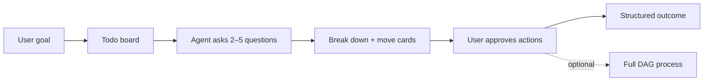

# Practical Multi-Agent Assistant — Phased Roadmap

Handoff for evolving **agent-platform** from a simulation-first orchestration demo into a **practical daily planning assistant**: personal planning, nutrition, fitness, travel, shopping, mentorship, coding help, and calendar organisation — without breaking existing process/team/simulation flows.

**Related:** [ADR 0001](./adr/0001-agent-platform-orchestration.md) (server authority), [action-orchestrator-api.md](./action-orchestrator-api.md), `app/todos/`, `web/src/features/todos/`.

---

## Vision

Users offload **decision-making and planning** to specialised AI agents. Each domain gets a familiar surface (kanban board + agent drawer), not a 3D simulation maze. Simulation and full DAG processes remain **power tools** for large jobs.



---

## Current state (baseline)

| Layer | What exists | Gap |
|-------|-------------|-----|
| **Todo boards** | Kanban, categories, agent chat/step, action orchestrator | Hidden in nav; no templates |
| **Planner profiles** | `life-admin`, `code-task-planner`, `research-scout`, `sprint-planner` | Missing domain-specific packs |
| **Processes** | Server DAG, approval, SSE, audit | Disconnected from todos |
| **Simulation** | In-browser `AgentSimulation`, 3D optional | Default entry; competes with todos |
| **Interactive forms** | `presentPlanningForm` in project chat | Not wired to todo agent |

---

## Architecture principles (do not break)

1. **Server owns lifecycle** — runs, todo mutations, and agent steps persist on the API; the browser renders and sends intents ([ADR 0001](./adr/0001-agent-platform-orchestration.md)).
2. **Progressive disclosure** — simple home → board → agent drawer; simulation and DAG are opt-in.
3. **Domain packs** — extend via planner profiles + action sets + board templates, not one mega-prompt.
4. **Human-in-the-loop by default** — agent proposes; user approves actions before board changes.
5. **Project scoping** — todo boards belong to a project; switching projects must not leak state.

---

## Phase 1 — UX foundation ✅ (in progress)

**Goal:** Users discover planning boards without learning, the simulation workspace first.

### Steps

| # | Task | Files | Acceptance |
|---|------|-------|------------|
| 1.1 | **Home hub** at `/app/` with Start planning / Agent workspace / Manage teams | `PracticalHomePage.tsx`, `AppRoutes.tsx` | New users see three clear actions |
| 1.2b | **AppNavShell** on todo pages with global nav + project switcher | `AppNavShell.tsx`, todo pages | Todo pages no longer orphan; project switcher works |
| 1.2 | **Plans** link in workspace header | `Header.tsx` | One click from simulation → todos |
| 1.3 | **Remember last board** on server (`project.last_todo_board_id`) | `planning_context.py`, `GET /boards/{id}` records visit | Home “Continue planning” uses server state per project |
| 1.4 | Path helpers | `paths.ts` | `todosListPath`, `todoBoardPath`, `homePath` |

### Out of scope (Phase 1)

- Changing simulation behaviour
- Moving orchestration off the browser (Phase 4)

---

## Phase 2 — Domain packs & board templates

**Goal:** One-click boards for real-life domains with the right planner agent per category.

### Steps

| # | Task | Files | Acceptance |
|---|------|-------|------------|
| 2.1 | Add planner profiles: nutrition, fitness, travel, shopping, mentorship, calendar | `app/todos/seeds.py` | `GET /todos/planner-profiles` lists new slugs |
| 2.2 | Board template definitions | `app/todos/board_templates.py` | Templates documented in API |
| 2.3 | `template_slug` on board create + `GET /todos/board-templates` | `schemas.py`, `board_service.py`, `routes.py` | Creating with `life-weekly` seeds categories |
| 2.4 | Template picker UI on board list | `TodoBoardListPage.tsx`, `todosApi.ts` | User picks “Weekly life” template when creating |
| 2.5 | Seed idempotent profile upsert for new slugs on startup | `seeds.py` | Existing DBs gain new profiles without wipe |

### Domain template matrix (target)

| Template slug | Board name | Categories → profile |
|---------------|------------|----------------------|
| `life-weekly` | This week | Personal → life-admin, Errands → life-admin, Health → fitness-coach |
| `meal-plan` | Meal plan | Meals → nutrition-coach, Shopping → shopping-planner |
| `travel-trip` | Trip planner | Research → travel-planner, Bookings → travel-planner, Packing → life-admin |
| `coding-sprint` | Dev sprint | Features → code-task-planner, Bugs → code-task-planner, Learning → research-scout |
| `mentorship` | Growth | Goals → mentorship-coach, Skills → mentorship-coach, Reflection → life-admin |

---

## Phase 3 — Interactive planning forms

**Goal:** Agents ask structured questions (diet restrictions, travel dates, gym level) before breaking down tasks.

### Steps

| # | Task | Files | Acceptance |
|---|------|-------|------------|
| 3.1 | Add `present_planning_form` action to todo-board-ops | `seeds.py`, `applyAgentActions.ts` | Agent can return form spec in step response |
| 3.2 | Reuse `PlanningFormBlock` in `AgentDrawer` | `AgentDrawer.tsx`, `PlanningFormBlock.tsx` | User fills form inline; answers sent as next agent message |
| 3.3 | Profile prompts reference form tool for ambiguous goals | `seeds.py` system prompts | Nutrition/travel profiles ask clarifying questions first |
| 3.4 | Persist form answers on item (`metadata_json` or description append) | `models.py`, migration if needed | Re-open drawer shows prior answers |

---

## Phase 4 — Stability & server authority

**Goal:** Tab refresh, sleep, and multi-device use never lose planning state or leave runs stuck.

### Steps

| # | Task | Files | Acceptance |
|---|------|-------|------------|
| 4.1 | Todo item event log (agent steps, applied actions) | new `todo_item_events` table, routes | Audit trail per card |
| 4.2 | Route project kanban task execution through server (optional flag) | `AgentSimulation.ts`, API | Same task survives refresh |
| 4.3 | Simulation becomes presentation-only for task state | ADR update, `AgentHost` | 3D reflects server state |
| 4.4 | Link todo item → process (`linked_process_id` already on model) | UI + `POST items/{id}/spawn-process` | “Escalate to full team” from card |
| 4.5 | Integration tests for project switch + todo isolation | `test_todos_api.py`, `projectLifecycle.test.ts` | No cross-project board bleed |

---

## Phase 5 — Integrations (export & hooks)

**Goal:** Plans connect to tools users already use — calendar, shopping lists, reminders.

### Steps

| # | Task | Files | Acceptance |
|---|------|-------|------------|
| 5.1 | Export actions: `.ics` blocks, markdown checklist, JSON | action set + client handlers | User downloads calendar file from approved step |
| 5.2 | Webhook action type (`execution_mode: server`) | `action_orchestrator/` | Optional n8n/Zapier trigger |
| 5.3 | Document context in agent step (reuse workspace upload) | `agent_bridge.py` | Attach meal plan PDF to nutrition task |
| 5.4 | Shopping list structured output schema | profile prompt + `break_down_task` | Grouped grocery list in plan_json |

---

## Phase 6 — Polish & onboarding

**Goal:** Low friction for first-time users; power features stay discoverable.

### Steps

| # | Task | Files | Acceptance |
|---|------|-------|------------|
| 6.1 | Onboarding tooltip tour (home → board → agent drawer) | server `planning_prefs_json.onboarding_dismissed` | Skippable 3-step tour |
| 6.2 | Empty-state examples per template | `TodoKanbanPage.tsx` | “Try: Plan dinners for Mon–Fri” |
| 6.3 | Mobile-friendly kanban (horizontal scroll columns) | CSS only | Usable on phone |
| 6.4 | Rename product copy: “Agent Simulator” → “Planning workspace” where appropriate | Header, InfoModal | Less simulation-anxiety for new users |

---

## Phase 7 — Personal Assistant product

**Goal:** A simulation-free, chat-first product at `/app/assistant` where the user executes and AI organizes — distinct from Agent Workspace.

| # | Task | Files | Acceptance |
|---|------|-------|------------|
| 7.1 | Assistant API (`/api/v1/assistant/*`) | `app/assistant/` | Dashboard, chat, complete, reviews |
| 7.2 | Assistant board per project | `assistant_service.py`, `personal-assistant` template | Auto-created on first visit |
| 7.3 | Dashboard page + nav | `AssistantDashboardPage.tsx`, `AppNavShell`, `paths.ts` | Home → Assistant; horizon tabs + chat |
| 7.4 | Home hub product split | `PracticalHomePage.tsx` | Assistant vs boards vs workspace cards |
| 7.5 | Reviewer loop | `review_service.py`, `ReviewBanner.tsx` | Run review → approve adjustments |
| 7.6 | Tests | `test_assistant_api.py` | Dashboard, chat mock, complete, isolation |
| 7.7 | Domain profiles + intake forms | `assistant_domain_profiles`, `domain_forms.py` | Fitness/travel forms; DB persistence per project |

**Product split:** Assistant = user executes; Workspace = agents execute. Plans (kanban) remain a board drill-down linked from Assistant.

**Profile memory:** Domain facts (fitness stats, travel dates, diet prefs) persist in `assistant_domain_profiles` per project. Agents check `profile_gaps` and show `PlanningFormBlock` in chat when required fields are missing.

---

## Implementation status

| Phase | Status | Notes |
|-------|--------|-------|
| 1 — UX foundation | **Done** | Home hub, nav, server last-board |
| 2 — Domain packs | **Done** | Profiles + board templates |
| 3 — Planning forms | **Done** | `present_planning_form`, AgentDrawer, metadata |
| 4 — Server authority | **Done** | Apply on server, item events, spawn-process |
| 5 — Integrations | **Done** | Markdown/ICS export, server webhook, document context, grocery schema |
| 6 — Polish | **Done** | Onboarding tour, empty-state hints, mobile kanban scroll, copy refresh |
| 7 — Personal Assistant | **Done** | `/assistant` dashboard, API, nav, home split |

**Storage rule:** UI does not use `localStorage` for planning state. Server DB is authoritative; optional in-memory React state only for the current session view.

---

## Testing checklist (run after each phase)

```bash
# Backend
cd app && pytest tests/test_todos_api.py -q

# Frontend
cd web && pnpm run test

# Assistant API
cd app && pytest tests/test_assistant_api.py -q

# Manual smoke
# 1. Open /app/ → Personal Assistant card → /assistant
# 2. Chat → approve proposed actions → tasks appear on dashboard
# 3. Complete a task → stats update; Run review → approve suggestions
# 4. Board view link → kanban; Workspace still loads separately
# 5. Switch project → assistant board/chat scoped correctly
```

---

*Last updated: 2026-05-25 — Phases 1–7 complete; server webhook + workspace docs in agent steps; home onboarding tour.*
</tool_call>